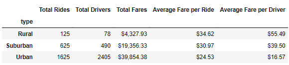
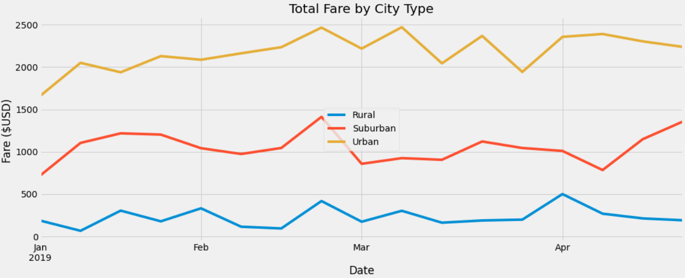

# __PyBer Analysis__

# __Overview of the analysis__

Following the initial analysis, V. Isualize gave us two new tasks:

  1.	Create a summary DataFrame of the ride-sharing data by city type. 
  2.	Create a multiple-line graph that shows the total weekly fares for each city type. 

After completing these two tasks, we were to summarize how the data varied by city type and how any differences could inform future decisions at PyBer.

# __Results__

**Figure 1 - Ride-sharing data across city types**

**Total Rides / Total Drivers** 
  - Urban cities had significantly higher numbers of rides and drivers than suburban or rural cities.
  - Urban vs. Suburban: Urban cities had approximately 2.5x more rides and 5x more drivers than suburban cities.
  - Urban vs. Rural: Urban cities had approximately 13x more rides and 31x more drivers than rural cities.

**Total Fares** 
  - Urban cities had significantly higher total fares than than suburban or rural cities.
  - *Urban vs. Suburban*: Urban cities brought in over $20 million more in total fares than suburban cities.
  - *Urban vs. Rural*: Urban cities brought in over $35 million more in total fares than rural cities.

**Average Fare per Ride / Average Fare per Driver**
  - Rural cities had the highest average fares per ride and average fares per driver compared to suburban and urban cities.
  - *Rural vs. Suburban*: Rural cities had approximately 12% higher average fares per ride and 40% higher fares per driver than suburban cities.
  - *Rural vs. Urban*: Rural cities had approximately 41% higher average fares per ride and 235% higher fares per driver than urban cities.

**Figure 2 - Total Fares by City Type**

**Total Fares by City Type**
  - The leader of total fares of by city type is consistent throughout, with urban cities having the highest total fares, followed by suburban then rural.
  - There is not a single week in which the total fares for one city type eclipses another.
  - The total fares for each city type are relatively range bound within a band of approximately $500.
  - There are very few shared spikes or falls across all 3 city types. The only shared spike across all 3 city types is in late February, which is followed by the only shared fall the week after.

# __Recommendations to address disparities among city types__

  1. *Pilot driver expansion in rural areas*: The total number of rides was significantly lower in rural areas. One reason for lower ridership might be the limited access to drivers. To test this you could pilot an expansion of the pool of drivers in rural areas to study its effects on the total number of rides, total fares, and other key ride-sharing metrics in rural areas.
  2. *Pilot higher fares in urban areas*: The average fares per driver was significantly lower in urban areas. To improve driver wage parity and driver satisfaction, you could pilot an increase to the price of rides (or the proportion of drivers' profit per ride) in urban areas to study its effects on urban driver satisfaction and other key ride-sharing metrics in urban areas.
  3. *Pilot lower fares in rural areas*: The average fares customers paid per ride was significantly higher in rural areas. To test if these higher fares was limiting ridership in rural areas, you could reduce the fare price in rural areas and study its effects on the total number of rides, total fares, and other key ride-sharing metrics in rural areas.

# __Data Sources__

  1. [PyBer_Challenge.ipynb](PyBer_Challenge.ipynb)
  2. [city_data.csv](Resources/city_data.csv)
  3. [ride_data.csv](Resources/ride_data.csv)
  4. [merged_pyber_data.csv](merged_pyber_data.csv)
  
