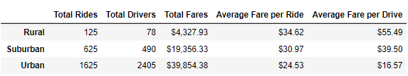
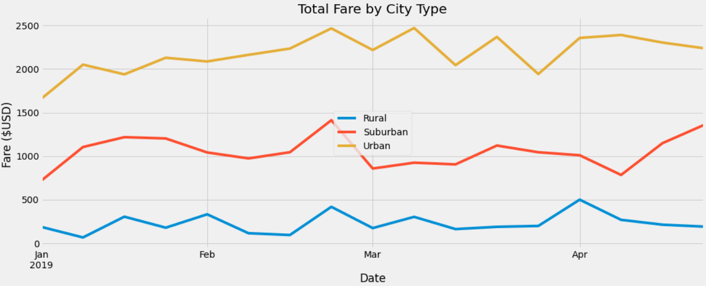

# __PyBer Analysis__

# __Overview of the analysis__

Following the initial analysis, V. Isualize gave us two new tasks:

  1.	Create a summary DataFrame of the ride-sharing data by city type. 
  2.	Create a multiple-line graph that shows the total weekly fares for each city type. 

After completing these two tasks, we were to summarize how the data varied by city type and how any differences could inform future decisions at PyBer.

# __Results__

Below is a summary of the ride-sharing data across the different city types:

**__Total Rides / Total Drivers__**: 
  - Urban cities had significantly higher numbers of rides and drivers than suburban or rural cities.
  - Urban vs. Suburban: Urban cities had approximately 2.5x more rides and 5x more drivers than suburban cities.
  - Urban vs. Rural: Urban cities had approximately 13x more rides and 31x more drivers than rural cities.

**Total Fares**: 
  - Urban cities had significantly higher total fares than than suburban or rural cities.
  - Urban vs. Suburban: Urban cities brought in over $20 million more in total fares than suburban cities.
  - Urban vs. Rural: Urban cities brought in over $35 million more in total fares than rural cities.

**Average Fair per Ride / Average Fair per Drive**: 
asdf

# __Recommendations to address disparities among city types__

  1. Sdf
  2. Asf
  3. Asdf
  4. ASD

# __Data Sources__

  1. sdf
  2. asd
  3. asdf
  4. asdf
